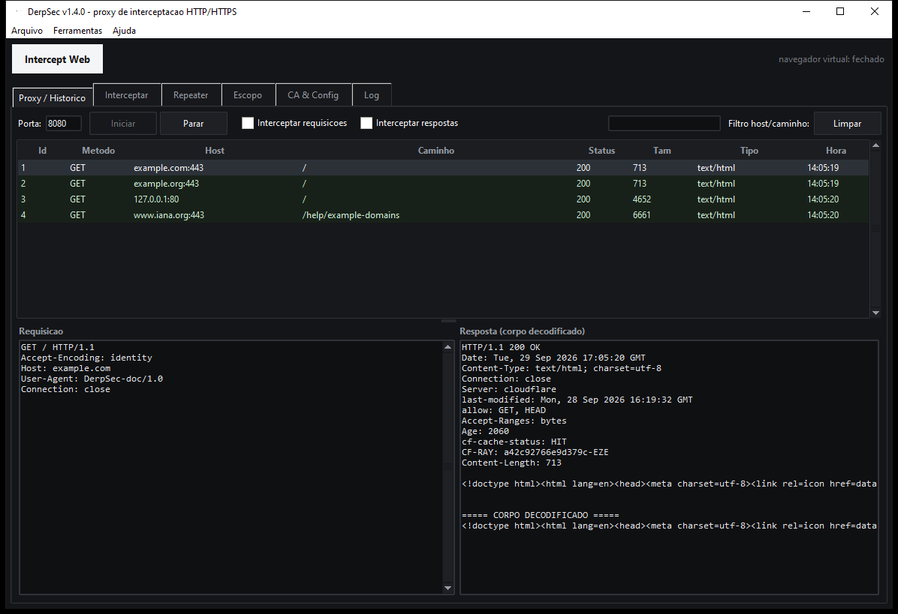
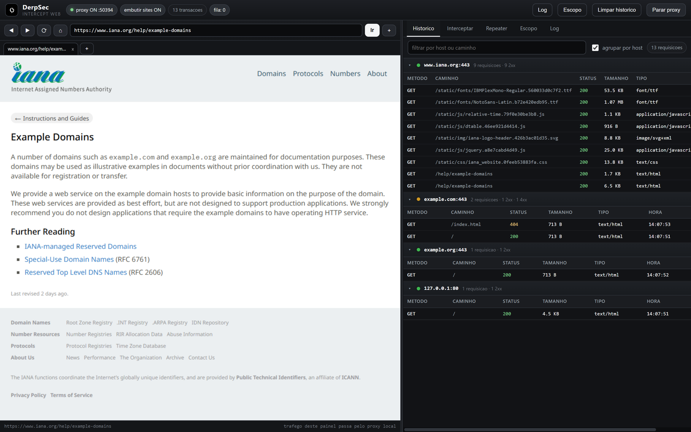
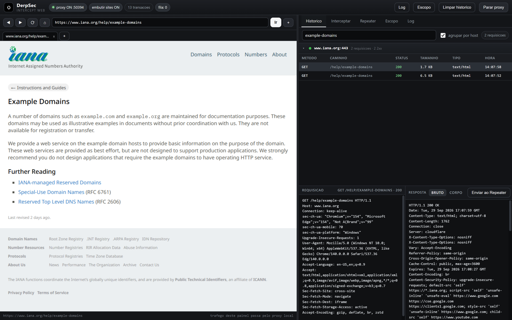
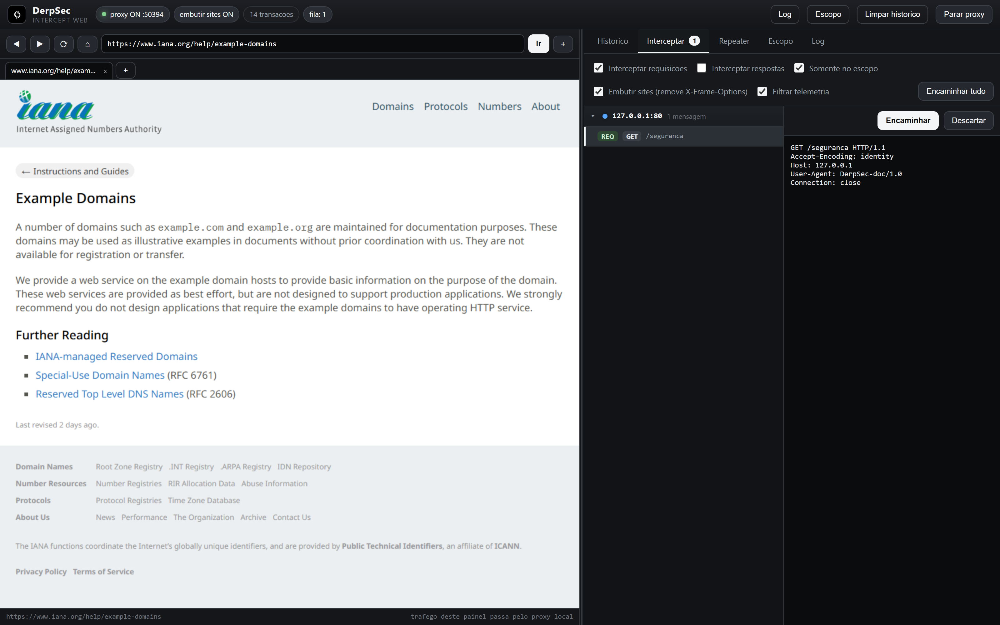
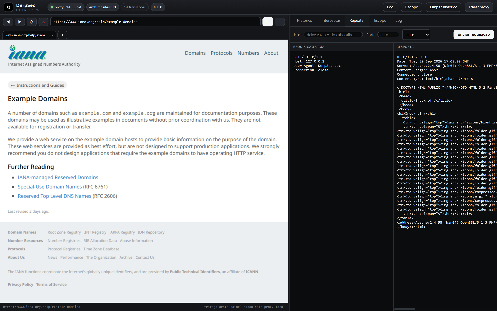
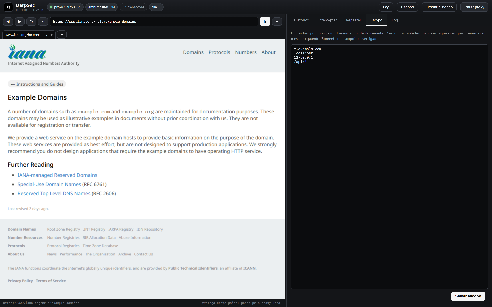

# DerpSec

Proxy de interceptação HTTP/HTTPS para Windows, escrito em Python + Tkinter.
**100% open source (licença MIT)**, funciona **localmente**, sem conta, sem nuvem e sem telemetria.

- Aplicativo portátil: `DerpSec.exe` (gerado pelo PyInstaller, veja *Compilando do código-fonte*)

---

## Imagens

### Aplicativo (Tkinter)



### Intercept Web — Histórico



### Intercept Web — Detalhe da transação



### Intercept Web — Interceptar



### Intercept Web — Repeater



### Intercept Web — Escopo



> As imagens são capturas reais do aplicativo em execução, com tráfego real
> passando pelo proxy (domínios de documentação da IANA e um serviço local em
> `127.0.0.1`).

---

## Documentação

| Documento | Conteúdo |
|---|---|
| [docs/arquitetura.md](docs/arquitetura.md) | Como o projeto é organizado por dentro, fluxo de uma requisição e a API do console |
| [docs/intercept-web.md](docs/intercept-web.md) | Guia da bancada web: painéis, abas, opções e segurança do console |
| [docs/testes.md](docs/testes.md) | O que cada suíte de testes cobre |
| [docs/changelog.md](docs/changelog.md) | Histórico de versões |

---

## Recursos

| Recurso | Descrição |
|---|---|
| Proxy HTTP/HTTPS | Escuta em `127.0.0.1:8080` (porta configurável) |
| MITM de HTTPS | Autoridade certificadora própria; certificado folha gerado e assinado por host, em cache |
| Interceptar | Segura requisições (e respostas) na fila para edição manual antes de encaminhar |
| Histórico | Lista de todas as transações com método, host, caminho, status e tamanho |
| Repeater | Reenvia uma requisição bruta quantas vezes quiser, com edição do texto completo |
| Escopo | Filtro por `host`/`host:porta` com curingas (`*.exemplo.com`); afeta o que é processado |
| **Filtro de telemetria** | Liga por padrão: tráfego de fundo do Windows/Edge (telemetria, atualizações, anúncios) **nunca é segurado** na fila de interceptação — continua registrado no histórico, mas não atrapalha a bancada |
| **Intercept Web** | Abre uma **janela de navegador dedicada** (Edge/Chrome em modo app, sem barra do navegador) já apontando para o proxy, com a bancada de interceptação em **dois painéis**: o site à esquerda e as funções à direita |
| CA & Config | Gera a CA e instala no repositório do Windows (`certutil`) |
| Log | Registro de eventos do motor do proxy |

O tráfego é descriptografado com a CA local – por isso a CA precisa ser instalada e confiada para
que navegadores não exibam avisos de certificado.

---

## Uso rápido

1. Execute `DerpSec.exe`.
2. Clique em **Intercept Web**. O aplicativo sobe o proxy e abre uma janela de navegador dedicada
   (Edge ou Chrome em modo app), já configurada para `127.0.0.1:<porta>`, mostrando a bancada de
   interceptação: o **site à esquerda** e as **funções de interceptação à direita**.
3. Navegue pelas abas de navegador no topo do painel esquerdo (vários sites ao mesmo tempo) e use
   as abas do painel direito: **Histórico**, **Interceptar**, **Repeater**, **Escopo** e **Log**. No
   Histórico, as transações vêm **agrupadas por host:porta** em grupos que abrem e fecham.

### Navegador virtual (Intercept Web)

O botão **Intercept Web** cria uma sessão isolada, sem tocar no proxy do Windows nem no seu
navegador pessoal:

- Perfil dedicado em `%APPDATA%\DerpSec\webprofile` (perfil local, sem conflito com o navegador já aberto).
- Inicia com `--proxy-server=127.0.0.1:<porta>` e `--ignore-certificate-errors`, então o tráfego já
  passa pelo proxy e o MITM funciona mesmo sem instalar a CA no sistema.
- A janela abre em **modo app** (`--app=`): sem barra de endereço nem abas do navegador — quem manda é
  a bancada do DerpSec.
- A página inicial é o próprio console, servido em `127.0.0.1` por um servidor local do aplicativo.

O console é uma interface web (HTML/CSS/JS) com o mesmo tema escuro do aplicativo (cinza escuro, branco
preto) e a logo do projeto, montada em **dois painéis** com uma divisória arrastável:

| Painel | O que faz |
|---|---|
| Esquerda – **site** | Barra de endereço, voltar/avançar/recarregar/início, **abas de navegação** e o site carregado de verdade (`iframe`) dentro da janela |
| Direita – **funções** | Abas de interceptação: **Histórico**, **Interceptar**, **Repeater**, **Escopo** e **Log** |

| Aba | O que faz |
|---|---|
| Histórico | Lista/filtra transações **agrupadas por `host:porta`** em grupos colapsáveis, abre requisição e resposta cruas |
| Interceptar | Segura requisições/respostas na fila; **Encaminhar**, **Editar** ou **Descartar** — sua edição em andamento é preservada quando novas mensagens chegam |
| Repeater | Monta e reenvia requisições brutas quantas vezes quiser |
| Escopo | Define os padrões de host que o proxy processa |
| Log | Eventos do motor em tempo real |

Opções do painel de funções:

- **Filtrar telemetria** – ligado por padrão. O tráfego de fundo do Windows/Edge (telemetria,
  atualizações, anúncios) continua no histórico, mas **nunca é segurado** na fila de interceptação,
  então não sequestra a navegação do console nem interrompe o seu fluxo de trabalho.
- **Embutir sites (remover X-Frame-Options e frame-ancestors)** – ligado por padrão. Muitos sites
  proíbem ser exibidos dentro de `iframe`; com esta opção o proxy remove `X-Frame-Options` e a
  diretiva `frame-ancestors` do CSP das respostas HTML, para que o site apareça no painel esquerdo.
  Desligue-a se quiser ver as respostas exatamente como o servidor enviou.
- **Interceptar requisições/respostas**, **Interceptar somente o escopo** e **Iniciar/Parar** o proxy
  também pelo console — as mudanças refletem na janela do aplicativo e são salvas na configuração.

A barra de endereço do console acompanha a navegação dentro do `iframe` (via `postMessage`), sem
recarregar a página nem entrar em loop de navegação.

Acesso protegido por token aleatório por sessão (o console exige o token em cada chamada de API e
valida o cabeçalho `Host`, o que evita sequestro de sessão local e *DNS rebinding*).

> Não é mais necessário mexer no proxy do Windows: o navegador virtual cuida do próprio proxy.
> Se preferir o seu navegador normal, configure o proxy manualmente em `127.0.0.1:<porta>`.

### Encerrando

Feche o navegador virtual ou clique em **Parar** no console. A CA pode ser removida com:

```
certutil -delstore Root derpsec
```

---

## Onde ficam os dados

| Caminho | Conteúdo |
|---|---|
| `%APPDATA%\DerpSec\config.json` | porta, caminho raiz, opções |
| `%APPDATA%\DerpSec\webprofile` | perfil do navegador virtual (Intercept Web) |
| `%APPDATA%\DerpSec\ca\derpsec-ca.crt` / `.key` / `.pem` | chave e certificado da CA |
| `%APPDATA%\DerpSec\ca\hosts\<host>.pem|.key` | certificados folha em cache |

Na primeira execução, o DerpSec migra automaticamente `config.json` e a CA do diretório antigo
`%APPDATA%\Intercepta` (se existir), sem perder configuração nem certificados já confiados.

---

## Compilando do código-fonte

Requisitos: Python 3.10+ (testado em 3.14) com Tkinter, e PyInstaller.

```bash
pip install pyinstaller cryptography
```

Aplicativo (usa o `DerpSec.spec` da raiz):

```bash
python -m PyInstaller --noconfirm --clean --onefile --windowed --name DerpSec \
  --icon "C:/caminho/build/intercepta.ico" \
  --add-data "icon/logo.png;icon" \
  --workpath build/work --specpath build --distpath dist main.py
```

> Use **caminhos absolutos** no `--icon` quando `--specpath` estiver definido.

### Executando a partir do código

```bash
python main.py
```

---

## Testes

```bash
python tests/selftest.py   # 10 testes do motor (proxy, MITM, intercept, repeater, escopo)
python tests/realtest.py   # HTTPS real via proxy (example.com, api.github.com) + HTTP
python tests/webtest.py    # 43 testes ponta a ponta do Intercept Web (console, API, flags, grupos, intercept, repeater, filtro de telemetria)
python tests/guitest.py    # integração GUI <-> Intercept Web (config, proxy, console, rotas /api/flags e /api/proxy)
```

---

## Estrutura do projeto

```
intercepta/
├─ main.py                    # ponto de entrada
├─ intercepta/                # pacote do aplicativo
│  ├─ gui.py                  # interface Tkinter
│  ├─ engine.py               # motor do proxy
│  ├─ certs.py                # CA local e certificados folha
│  ├─ httpmsg.py              # leitura/escrita de HTTP cru
│  ├─ browser.py              # navegador virtual do Intercept Web
│  └─ webconsole.py           # console web (HTML/CSS/JS + API)
├─ tests/                     # selftest, realtest, webtest, guitest
├─ docs/                      # documentação
├─ screenshots/               # imagens usadas na documentação
├─ icon/logo.png              # logo do projeto
├─ installer/setup.py         # instalador
├─ DerpSec.spec               # receita do PyInstaller
└─ LICENSE                    # MIT
```

---

## Limitações conhecidas

- `curl` do Windows (agenda Schannel) pode recusar o MITM com
  `schannel: the revocation status is unknown`, porque os certificados gerados não têm CRL/OCSP.
  Use `curl --ssl-no-revoke` ou qualquer navegador/Python `requests` – não afeta eles.
- HTTP/2 não é negociado: o proxy fala HTTP/1.1 com o destino.
- Sem suporte a WebSocket e sem scanner ativo de vulnerabilidades (o foco é interceptação).

---

## Licença

MIT — veja [LICENSE](LICENSE).

---

## Aviso legal

Ferramenta destinada a testes de segurança autorizados, desenvolvimento e depuração.
Intercepte somente tráfego que você tem autorização para interceptar. Licença MIT – sem garantias.
